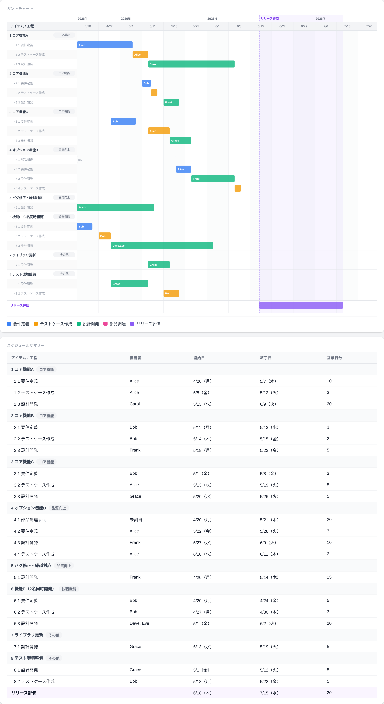

# WBS・ガントチャート → JIRA 連携ツール

## プロジェクトの計画から JIRA チケット作成まで、ワンストップで

ファイル1つ、インストールなし。開発項目を入力するだけで **WBS 番号付きのガントチャートを自動生成**し、そのまま **JIRA に一括インポートできる CSV** を出力します。

[](LICENSE)
[](gantt-generator.html)
[](gantt-generator.html)

**[→ gantt-generator.html をダウンロードして開くだけで使えます](gantt-generator.html)**



---

## このツールが解決すること

プロジェクト開始時、「誰が・いつ・何日かけて・何をやるか」を決めるのは手間がかかります。

- Excel でガントチャートを手動で書く → 担当者の空き状況を手で考える
- JIRA にチケットを先に作る → スケジュールが不確かなまま日付を入れる
- Mermaid でガントチャートを書く → 担当者の割り当ては自動化できない

このツールは「**計画フェーズ**」と「**JIRA 登録**」の間のギャップを埋めます。

---

## ワークフロー

```text
1. 計画する          2. 可視化する          3. JIRA に登録する
┌─────────────┐    ┌──────────────────┐    ┌──────────────────┐
│ アイテム     │    │ WBS番号付き       │    │ Task / Sub-task  │
│ フェーズ     │ →  │ ガントチャート    │ →  │ 一括インポート    │
│ 担当者       │    │ スケジュール表    │    │ (JIRA CSV)       │
└─────────────┘    └──────────────────┘    └──────────────────┘
   リソース制約付き     PNG / HTML 出力         Epic に紐付け
   自動スケジューリング
```

担当者の空き状況・稼働率・担当可能工程を考慮したスケジュールが自動で決まり、WBS 番号付きの CSV で JIRA に一括登録できます。

---

## Mermaid・PlantUML との違い

Mermaid や PlantUML のガントチャートは「すでに決まったスケジュールを図にする」ツールです。このツールは「**誰が・いつ・何日かけてやるか**を自動で決める」ところから始めます。

### 機能比較

| 機能 | このツール | Mermaid | PlantUML |
| ---- | :---------: | :-------: | :--------: |
| インストール不要 | ✅ | ✅ (CDN利用時) | ❌ Java必須 |
| GUI エディタ | ✅ | ❌ コード記述 | ❌ コード記述 |
| **担当者の自動割り当て** | ✅ | ❌ | ❌ |
| **リソース競合の自動回避** | ✅ | ❌ | ❌ |
| **担当可能工程の制約** | ✅ | ❌ | ❌ |
| **稼働率・参画開始日の考慮** | ✅ | ❌ | ❌ |
| **並行バックグラウンドタスク** | ✅ | ❌ | ❌ |
| **営業日カレンダー（祝日対応）** | ✅ | ❌ | ❌ |
| **リリース評価超過の警告** | ✅ | ❌ | ❌ |
| **WBS 番号自動付番** | ✅ | ❌ | ❌ |
| **JIRA CSV 一括エクスポート** | ✅ | ❌ | ❌ |
| リアルタイムプレビュー | ✅ | △ (要ビルド) | ❌ |
| 日 / 週 / 月 ズーム切替 | ✅ | ❌ | ❌ |
| PNG / HTML エクスポート | ✅ | △ | △ |
| JSON で設定保存・復元 | ✅ | △ (コード自体) | △ (コード自体) |
| テキストベースでバージョン管理 | △ (JSON) | ✅ | ✅ |

### 具体的なシナリオで比較

Mermaid では担当者を**手動でスケジュールに当てはめる**必要があります。

```text
%%{Mermaid でやろうとすると…}%%
gantt
    section Alice（企画）
    要件定義A :a1, 2026-04-20, 10d
    要件定義B :a2, after a1, 5d   ← 手動で順番を決める必要がある
    section Bob（開発）
    設計開発A :b1, after a1, 20d  ← Aliceが終わったら、と手動で指定
    設計開発B :b2, after b1, 10d
    ← 「Bobが80%稼働で5月から参画」「Carolが設計開発しかできない」は表現不可
```

このツールでは担当者の制約を設定するだけで、日付や順序は自動で決まります。

```jsonc
// 担当者の制約を定義するだけでOK
"people": [
  { "name": "Alice", "phases": ["要件定義"], "utilization": 1.0 },
  { "name": "Bob",   "phases": ["設計開発"], "availableFrom": "2026-05-01", "utilization": 0.8 },
  { "name": "Carol", "phases": ["設計開発"], "utilization": 1.0 }
],
"items": [
  {
    "name": "機能A",
    "phases": [
      { "type": "要件定義", "days": 10 },   // → Aliceが自動で担当
      { "type": "設計開発", "days": 20 }    // → BobまたはCarolが自動で担当
    ]
  }
]
// スケジュールは自動計算。担当者の空き・稼働率・参画日を全部考慮。
```

### Mermaid・PlantUML が適しているケース

- **バージョン管理で差分を追いたい**（テキストファイルなので git diff が使いやすい）
- **CI/CD パイプラインに組み込みたい**（コードとして扱える）
- **すでにスケジュールが確定していて図にしたいだけ**

このツールは「**スケジュールを計画する**」フェーズに特化しています。

---

## 主な機能

### WBS 自動付番

アイテムに `1`, `2`, `3`… の番号、フェーズに `1.1`, `1.2`… の枝番を自動で付けます。ガントチャートの行ラベルとスケジュールサマリー表に表示され、JIRA の課題 Summary にもそのまま反映されます。

```text
ガントチャート行ラベル:
  1 コア機能A
    └ 1.1 要件定義
    └ 1.2 設計開発
    └ 1.3 テスト
  2 オプション機能B
    └ 2.1 要件定義
    └ 2.2 設計開発
```

### JIRA CSV 一括エクスポート

「JIRA CSV」ボタン1つで、JIRA に一括インポートできる CSV を生成します。アイテムを **Task**、フェーズを **Sub-task** として出力し、Epic との紐付けも自動で設定します。

| 列 | Task（アイテム） | Sub-task（フェーズ） |
| ---- | ---- | ---- |
| `Issue Type` | `Task` | `Sub-task` |
| `Summary` | `1 コア機能A` | `1.1 要件定義 — コア機能A` |
| `Epic Link` | プロジェクトの Epic キー | 空 |
| `Parent` | 空 | 親 Task の Summary |
| `Assignee` | 最初のフェーズ担当者 | 当該フェーズの担当者 |
| `Start Date` / `Due Date` | アイテム全体の開始・終了日 | フェーズの開始・終了日 |
| `Story Points` | 全フェーズ合計工数（日数） | フェーズ工数（日数） |

担当者には JIRA ユーザー名（メールアドレスなど）を個別にマッピングできます。

### 自動スケジューリング（LPT アルゴリズム）

残りパイプライン工数が多いタスクを優先的に割り当てる LPT（Longest Processing Time）方式で、全体の完了を最短化します。担当者の空き状況を1営業日単位でシミュレーションします。

```text
優先度 = 自タスク以降のフェーズ工数の合計

例: [要件定義 5日] → [設計開発 20日] → [テスト 3日]
  └ 要件定義の優先度 = 5+20+3 = 28日
  └ より長いパイプラインを持つタスクが先に担当者を確保
```

### リソース制約

| 設定 | 説明 |
| ---- | ---- |
| `allowedPeople` | フェーズを担当できる人を限定（省略時は適任者を自動選択） |
| `requireAll` | 指定した全員が同時着手（ペアプロ・共同作業に） |
| `background` | 工数を消費しない並行進行タスク（調達待ち・外注など） |
| `fixedStart` | 特定日に強制開始（外部依存がある場合） |
| `availableFrom` | 参画開始日（中途合流メンバーに） |
| `utilization` | 稼働率（0.8 = 80%稼働） |

### 営業日カレンダー

- 土日を自動除外
- 国民の祝日をバンドル済み（2024〜2028年）
- [holidays-jp API](https://holidays-jp.github.io) からワンクリックで最新データに更新
- 会社独自の休業日（年末年始・創立記念日など）を別途登録可能

### 表示・エクスポート

- **3段階ズーム**: 日 / 週 / 月 単位を切替（3ヶ月プロジェクトは週単位、1年超は月単位など）
- **リアルタイムプレビュー**: 設定変更のたびに即時反映
- **JIRA CSV 出力**: Task / Sub-task 階層で JIRA に一括インポート
- **HTML 出力**: スタンドアロン HTML として保存・共有
- **PNG 出力**: スライド・ドキュメントに貼り付け可能な画像として保存
- **JSON 保存 / 読込**: 設定ファイルをチームで共有・バージョン管理

---

## クイックスタート

### 1. ファイルを開く

[`gantt-generator.html`](gantt-generator.html) をダウンロードし、ブラウザでダブルクリックします。  
サーバー不要、ネット接続不要で即起動します。

### 2. プロジェクト設定を入力する

「**プロジェクト設定**」タブで開始日・リリース日・評価期間を設定します。  
JIRA の Epic キー（例: `PROJ-1`）を入力しておくと、CSV の Epic Link 列に自動反映されます。

### 3. 工程タイプを定義する

「**工程タイプ**」タブで、プロジェクトで使う工程の種類・担当チーム・色を設定します。

### 4. アイテムとフェーズを入力する

「**アイテム**」タブで開発項目を追加し、各アイテムにフェーズ（工程の種類・工数・担当者制約）を設定します。  
WBS 番号（`1`, `1.1` など）は自動で付番されます。

### 5. 担当者を登録する

「**担当者**」タブで担当者ごとに担当可能な工程・参画開始日・稼働率・JIRA ユーザー名を設定します。

### 6. JIRA に登録する

「**JIRA CSV**」ボタンをクリックして CSV をダウンロードし、JIRA の「課題のインポート」から一括登録します。

> 設定は `localStorage` に自動保存されます。ブラウザを閉じても次回開いたときに復元されます。  
> チームで共有する場合は「JSON 保存」でファイルに書き出してください。

---

## 設定ファイル（JSON）の形式

```jsonc
{
  "projectName": "プロジェクト名",
  "startDate": "2026-04-20",
  "releaseDate": "2026-07-15",
  "evalPeriod": { "value": 4, "unit": "weeks" },  // "days" | "weeks" | "months"
  "ganttUnit": "weeks",                            // "days" | "weeks" | "months"
  "epicKey": "PROJ-1",                             // JIRA Epic キー（空欄可）

  "holidays": {
    "national": ["2026-04-29", "2026-05-03"],      // 国民の祝日
    "company":  ["2026-12-29", "2026-12-30"]       // 会社指定休業日
  },

  "phaseTypes": [
    { "name": "要件定義", "team": "企画", "color": "#3B82F6" },
    { "name": "設計開発", "team": "開発", "color": "#10B981" }
  ],

  "people": [
    {
      "name": "Alice",
      "team": "企画",
      "phases": ["要件定義"],          // 担当可能な工程タイプ
      "availableFrom": null,           // null = プロジェクト開始から参画
      "utilization": 1.0,              // 稼働率（0.5 = 50%稼働）
      "note": "",
      "jiraUser": "alice@example.com"  // JIRA ユーザー名（空欄時は name を使用）
    },
    {
      "name": "Bob",
      "team": "開発",
      "phases": ["設計開発"],
      "availableFrom": "2026-05-01",   // 5月から参画
      "utilization": 0.8,              // 80%稼働
      "note": "兼務あり",
      "jiraUser": "bob@example.com"
    }
  ],

  "items": [
    {
      "name": "機能A開発",
      "category": "コア機能",
      "note": "",
      "phases": [
        { "type": "要件定義", "days": 5 },
        {
          "type": "設計開発",
          "days": 10,
          "allowedPeople": ["Bob"],    // Bobのみ担当可
          "requireAll": false,         // true = 全員同時着手
          "background": false,         // true = 工数消費なし（並行進行）
          "fixedStart": null           // "YYYY-MM-DD" で強制開始日指定
        }
      ]
    }
  ],

  "evalPhase": { "name": "リリース評価", "color": "#8B5CF6" }
}
```

サンプル設定ファイル（全機能を使ったデモ）: [`examples/sample-config.json`](examples/sample-config.json)

---

## 技術仕様

| 項目 | 内容 |
| ---- | ---- |
| 配布形式 | 単一 HTML ファイル（約70KB） |
| 外部依存 | なし（PNG出力時のみ html2canvas を CDN から遅延ロード） |
| 動作環境 | モダンブラウザ（Chrome / Firefox / Safari / Edge） |
| データ保存 | localStorage（ブラウザ内） |
| スケジューリング | LPT アルゴリズム、1営業日単位シミュレーション |
| 祝日データ | 2024〜2028年バンドル済み + [holidays-jp API](https://holidays-jp.github.io) 対応 |
| JIRA 連携 | Task / Sub-task 階層の CSV（BOM 付き UTF-8、JIRA 一括インポート対応） |

---

## ライセンス

[MIT License](LICENSE)
